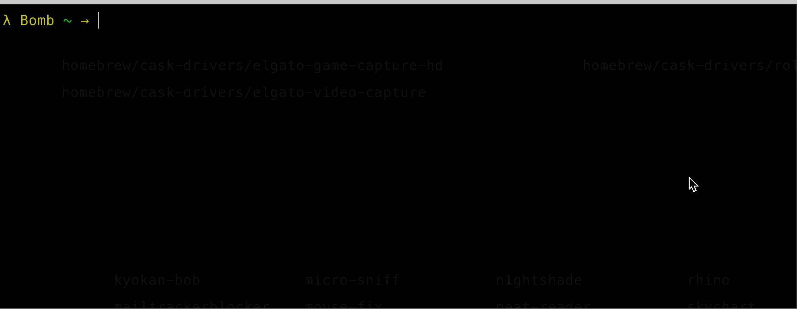

# gonetx/httpit
<p align="center">
  <a href="https://github.com/gonetx/httpit/actions?query=workflow%3ASecurity">
    
  </a>
  <a href="https://github.com/gonetx/httpit/actions?query=workflow%3ATest">
    
  </a>
  <a href="https://codecov.io/gh/gonetx/httpit">
    
  </a>
  <a href="https://github.com/gonetx/httpit#donate">
    
  </a>

</p>

`httpit` is a rapid http(s) benchmark tool which on top of [fasthttp](https://github.com/valyala/fasthttp). Also thanks to [cobra](https://github.com/spf13/cobra) and [bubbletea](https://github.com/charmbracelet/bubbletea).

## Installation
Get binaries from [releases](https://github.com/gonetx/httpit/releases) or via

```
// go1.16+
go install github.com/gonetx/httpit@latest
```

```
// before go1.16
go get -u github.com/gonetx/httpit
```

## Usage
```bash
Usage:
  httpit [url|:port|/path] [k:v|k:=v ...] [flags]

Examples:
        httpit https://www.google.com -c1 -n5   =>   httpit -X GET https://www.google.com -c1 -n5
        httpit :3000 -c1 -n5                    =>   httpit -X GET http://localhost:3000 -c1 -n5
        httpit /foo -c1 -n5                     =>   httpit -X GET http://localhost/foo -c1 -n5
        httpit :3000 -c1 -n5 foo:=bar           =>   httpit -X GET http://localhost:3000 -c1 -n5 -H "Content-Type: application/json" -b='{"foo":"bar"}'
        httpit :3000 -c1 -n5 foo=bar            =>   httpit -X POST http://localhost:3000 -c1 -n5 -H "Content-Type: application/x-www-form-urlencoded" -b="foo=bar"

Flags:
  -c, --connections int     Maximum number of concurrent connections (default 128)
  -n, --requests int        Number of requests(if specified, then ignore the --duration)
  -d, --duration duration   Duration of test (default 10s)
  -t, --timeout duration    Socket/request timeout (default 3s)
  -X, --method string       Http request method (default "GET")
  -H, --header strings      HTTP request header with format "K: V", can be repeated
                            Examples:
                                -H "k1: v1" -H k2:v2
                                -H "k3: v3, k4: v4"
      --host string         Override request host
  -a, --disableKeepAlives   Disable HTTP keep-alive, if true, will set header Connection: close
  -b, --body string         Http request body string
  -f, --file string         Read http request body from file path
  -s, --stream              Use stream body to reduce memory usage
  -J, --json                Send json request by setting the Content-Type header to application/json
  -F, --form                Send form request by setting the Content-Type header to application/x-www-form-urlencoded
  -k, --insecure            Controls whether a client verifies the server's certificate chain and host name
      --cert string         Path to the client's TLS Certificate
      --key string          Path to the client's TLS Certificate Private Key
      --httpProxy string    Http proxy address
      --socksProxy string   Socks proxy address
  -p, --pipeline            Use fasthttp pipeline client
      --follow              Follow 30x Location redirects for debug mode
      --maxRedirects int    Max redirect count of following 30x, default is 30 (work with --follow)
  -D, --debug               Send request once and show request and response detail
  -h, --help                help for httpit
  -v, --version             version for httpit
```

### Override host
Use `--host` to override `Host` header for the use case like `curl "http://127.0.0.1" -H "Host: www.example.com"` to bypass DNS resolving.

### Proxy
Use `--httpProxy` and `--socksProxy` to specific proxies for some rare cases.

### Pipeline
Use `-p|--pipeline` to specific fasthttp pipeline client.

### Debug
Use `-D|--debug` to send a request once and view the whole info.
```bash
httpit "http://httpbin.org/get" -JD  
Connected to httpbin.org(54.91.118.50:80)

GET /get HTTP/1.1
User-Agent: fasthttp
Host: httpbin.org
Content-Type: application/json


HTTP/1.1 200 OK
Server: gunicorn/19.9.0
Date: Wed, 17 Mar 2021 04:33:00 GMT
Content-Type: application/json
Content-Length: 269
Connection: keep-alive
Access-Control-Allow-Origin: *
Access-Control-Allow-Credentials: true

{
  "args": {}, 
  "headers": {
    "Content-Type": "application/json", 
    "Host": "httpbin.org", 
    "User-Agent": "fasthttp", 
    "X-Amzn-Trace-Id": "Root=1-6051867c-7effb4170f5e3057666ecb86"
  }, 
  "origin": "54.91.118.50", 
  "url": "http://httpbin.org/get"
}
```

## Examples
### Use duration
`httpit -X GET "http://httpbin.org/get" -H "accept: application/json" -c2 -d3s`


### Use count
`httpit -X GET "http://httpbin.org/get" -H "accept: application/json" -c2 -n15`



## Donate

If you use and love httpit, please consider sending some Satoshi to `3AJ3wgRP1mCxiFD8mqKkDZaCahwgDj3gSh`. 

In case you want to be mentioned as a sponsor, please let me know!


## Support
[](https://www.jetbrains.com/?from=httpit)
